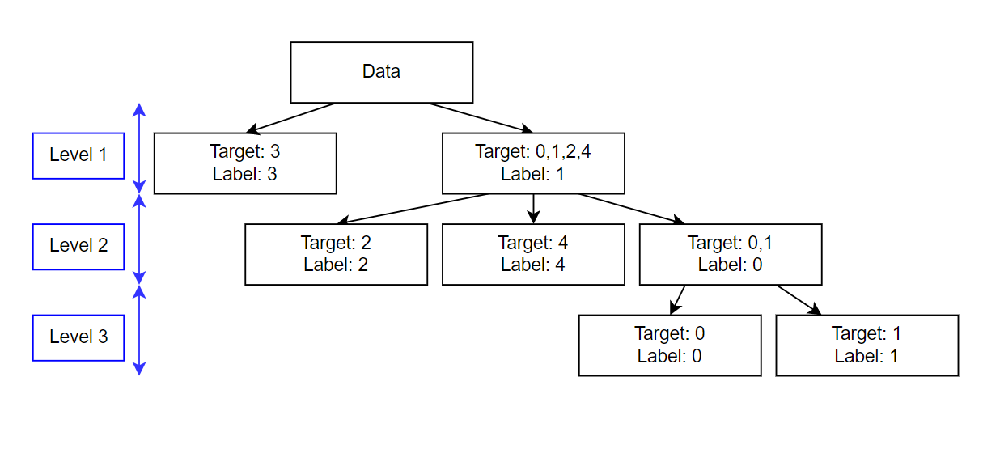

# 3-Level-Classification-Approach

#### When performing classification on imbalanced data, we usually either perform undersampling or oversampling.

#### In this project, a multi level approach has been presented to classify imbalanced data.

#### The above diagram shows the 3 level classification approach.

#### Original Data

| Label | Number of data points |
| ----- | --------------------- |
| 3     | 25003                 |
| 2     | 10008                 |
| 4     | 9996                  |
| 0     | 2498                  |
| 1     | 2495                  |

#### The first level is trained as a binary classifier, where the data can either have a label, 3 or 1. Label 1 is the assigned to all the data points that have a target value 0, 1 2 or 4. Label 3 is assigned to all the data points that have a target value of 3. By using this labelling technique, we can reduce the imbalance in the data. The distribution of the data is shown below.

| Label | Number of data points |
| ----- | --------------------- |
| 1     | 24997                 |
| 3     | 25003                 |

#### The second level model has 3 possible classes. Label 2 is assigned to all the data points that have a target value of 2. Label 4 is assigned to all the data points that have a target value of 4. Label 0 is assigned to all the data points that have a target value of 0 or 1. The remaining data points are assigned a label of -1 and are not included while training the level 2 model.

| Label | Number of data points |
| ----- | --------------------- |
| 0     | 4993                  |
| 2     | 10008                 |
| 4     | 9996                  |
| -1    | 25003 (Not included)  |

#### The third level is trained as a binary classifier, where the data can either have a label, 1 or 0. Label 1 is the assigned to all the data points that have a target value 1. Label 0 is assigned to all the data points that have a target value of 1. The remaining data points are assigned a label of -1 and are not included while training the level 3 model.

| Label | Number of data points |
| ----- | --------------------- |
| 0     | 2498                  |
| 1     | 2495                  |
| -1    | 45007 (Not included)  |
